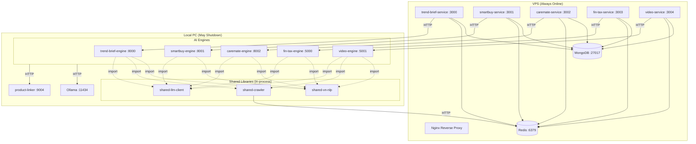
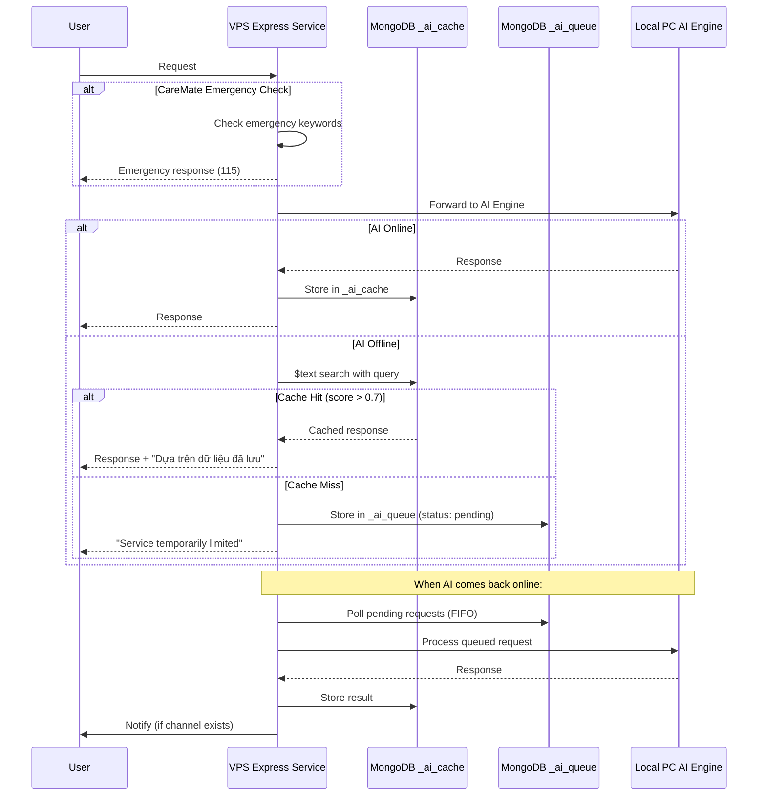
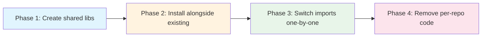

# Design Document: Shared Services

## Overview

This design defines the shared infrastructure layer (Release 2) that eliminates code duplication across 5 AI repositories. The system consists of:

- **3 Python libraries** (`shared-vn-nlp`, `shared-crawler`, `shared-llm-client`) installed via `pip install -e` and imported in-process by each AI engine
- **1 FastAPI microservice** (`product-linker` on port 9004) running on the local PC
- **1 offline resilience pattern** implemented per VPS Express.js service (TypeScript)

**Key constraints:**
- No Docker — bat scripts for startup
- Local PC (16-32GB RAM) may shutdown anytime
- VPS (always online) hosts Express.js, MongoDB, Redis
- Each AI engine keeps its own sentence-transformers + FAISS (NOT shared)
- Ollama already shared on :11434
- Offline resilience is implemented in VPS Express services (TypeScript), not Python

## Architecture



### Folder Structure

```
shared-libs/
├── shared-vn-nlp/
│   ├── pyproject.toml
│   ├── shared_vn_nlp/
│   │   ├── __init__.py
│   │   ├── nlp.py              # word_tokenize, NER, POS tagging
│   │   ├── slang.py            # slang normalization
│   │   ├── provinces.py        # province/region detection
│   │   ├── calendar.py         # VN events + lunar calendar
│   │   ├── sentiment.py        # sentiment analysis
│   │   └── data/
│   │       ├── vn_slang.json       # 100+ slang mappings
│   │       ├── vn_provinces.json   # 63 provinces + alternates
│   │       └── vn_events.json      # 30+ cultural events
│   └── tests/
│       ├── test_nlp.py
│       ├── test_slang.py
│       ├── test_provinces.py
│       └── test_properties.py  # property-based tests
│
├── shared-crawler/
│   ├── pyproject.toml
│   ├── shared_crawler/
│   │   ├── __init__.py
│   │   ├── engine.py           # config-driven crawl orchestrator
│   │   ├── extractors/
│   │   │   ├── __init__.py
│   │   │   ├── base.py         # BaseExtractor ABC
│   │   │   ├── rss.py          # feedparser-based
│   │   │   ├── html.py         # CSS selector-based (httpx + bs4)
│   │   │   ├── api.py          # JSON API extractor
│   │   │   └── playwright_ext.py  # JS-rendered pages
│   │   ├── rate_limiter.py     # Redis-backed per-domain limiter
│   │   ├── retry.py            # exponential backoff
│   │   ├── health.py           # crawl health tracking
│   │   ├── dedup.py            # URL hash deduplication
│   │   └── anti_bot.py         # User-Agent rotation + timing
│   └── tests/
│       ├── test_engine.py
│       ├── test_dedup.py
│       └── test_properties.py
│
├── shared-llm-client/
│   ├── pyproject.toml
│   ├── shared_llm_client/
│   │   ├── __init__.py
│   │   ├── client.py           # unified LLM client
│   │   ├── cache.py            # Redis response cache
│   │   ├── circuit_breaker.py  # circuit breaker pattern
│   │   ├── fallback.py         # fallback chain logic
│   │   ├── streaming.py        # SSE streaming support
│   │   └── providers/
│   │       ├── __init__.py
│   │       ├── base.py         # BaseProvider ABC
│   │       ├── ollama.py       # Ollama provider
│   │       ├── groq.py         # Groq free tier
│   │       └── template.py     # template-based fallback
│   └── tests/
│       ├── test_client.py
│       ├── test_circuit_breaker.py
│       └── test_properties.py
│
├── product-linker/
│   ├── pyproject.toml
│   ├── product_linker/
│   │   ├── __init__.py
│   │   ├── api.py              # FastAPI app
│   │   ├── config.py           # settings
│   │   ├── detector.py         # mention detection logic
│   │   └── models.py           # Pydantic models
│   └── tests/
│       └── test_detector.py
│
├── start-all.bat               # start product-linker + health checks
├── stop-all.bat                # stop all services
└── pyproject.toml              # workspace-level (optional)
```

## Components and Interfaces

### 1. shared-vn-nlp

Vietnamese NLP library providing consistent text processing across all AI engines.

```python
# shared_vn_nlp/__init__.py — Public API

from shared_vn_nlp.nlp import segment, ner, pos_tag
from shared_vn_nlp.slang import normalize_slang, load_slang_dict
from shared_vn_nlp.provinces import detect_provinces, get_all_provinces
from shared_vn_nlp.calendar import get_events, get_events_in_range, lunar_to_solar
from shared_vn_nlp.sentiment import analyze_sentiment
```

#### Module: nlp.py

```python
from typing import List, Tuple

def segment(text: str) -> List[str]:
    """Vietnamese word segmentation using underthesea.
    Returns empty list for empty/whitespace input."""
    ...

def ner(text: str) -> List[Tuple[str, str, str, str]]:
    """Named Entity Recognition. Returns list of (word, pos, chunk, ner_tag)."""
    ...

def pos_tag(text: str) -> List[Tuple[str, str]]:
    """POS tagging. Returns list of (word, tag) tuples."""
    ...
```

#### Module: slang.py

```python
from typing import Dict

def load_slang_dict() -> Dict[str, str]:
    """Load slang mappings from data/vn_slang.json. Min 100 entries."""
    ...

def normalize_slang(text: str) -> str:
    """Replace slang abbreviations with expansions.
    Case-insensitive matching, preserves non-slang casing.
    Idempotent: normalize(normalize(x)) == normalize(x)."""
    ...
```

#### Module: provinces.py

```python
from typing import List
from dataclasses import dataclass

@dataclass
class ProvinceMatch:
    name: str           # official name
    region: str         # e.g., "Đông Nam Bộ"
    matched_text: str   # what was found in input
    start: int          # position in text
    end: int

def detect_provinces(text: str) -> List[ProvinceMatch]:
    """Detect province mentions via regex. Supports official + alternate names."""
    ...

def get_all_provinces() -> List[dict]:
    """Return all 63 provinces with names, alternates, regions."""
    ...
```

#### Module: calendar.py

```python
from datetime import date
from typing import List
from dataclasses import dataclass

@dataclass
class VNEvent:
    name: str
    date_solar: date
    date_lunar: str | None  # e.g., "1/1" (lunar)
    event_type: str         # "holiday", "cultural", "seasonal"
    description: str

def get_events(target_date: date, days_range: int = 3) -> List[VNEvent]:
    """Get events on or near a date (±days_range)."""
    ...

def get_events_in_range(start: date, end: date) -> List[VNEvent]:
    """Get all events within a date range."""
    ...

def lunar_to_solar(lunar_month: int, lunar_day: int, year: int) -> date:
    """Convert lunar date to solar date for a given year."""
    ...
```

#### Module: sentiment.py

```python
from dataclasses import dataclass

@dataclass
class SentimentResult:
    label: str      # "positive", "negative", "neutral"
    score: float    # 0.0 to 1.0 confidence

def analyze_sentiment(text: str) -> SentimentResult:
    """Analyze Vietnamese text sentiment.
    Applies slang normalization before analysis.
    Returns neutral/0.0 for empty input."""
    ...
```

---

### 2. shared-crawler

Config-driven crawl engine that reads source definitions from MongoDB.

#### Crawl Source Config Schema (MongoDB)

```python
# MongoDB collection: crawl_sources
@dataclass
class CrawlSourceConfig:
    source_id: str              # unique identifier
    name: str                   # human-readable name
    type: str                   # "rss" | "html" | "api" | "playwright"
    url: str                    # target URL
    schedule_cron: str          # cron expression for scheduling
    consumers: List[str]        # ["trend-brief", "smartbuy", "video"]
    enabled: bool               # active/inactive toggle
    
    # Type-specific config
    selectors: dict | None      # CSS selectors for html type
    api_config: dict | None     # headers, params for api type
    rss_config: dict | None     # feed-specific options
    playwright_config: dict | None  # wait_for, scroll, etc.
    
    # Rate limiting
    rate_limit_rpm: int         # requests per minute for this domain
    
    # Metadata
    created_at: datetime
    updated_at: datetime
```

#### Module: engine.py

```python
from typing import List, AsyncIterator
from dataclasses import dataclass

@dataclass
class CrawlResult:
    url: str
    title: str
    content: str
    published_at: datetime | None
    source_id: str
    image_url: str | None
    metadata: dict

class CrawlEngine:
    """Config-driven crawl orchestrator."""
    
    def __init__(self, mongo_uri: str, redis_url: str):
        """Initialize with MongoDB (configs) and Redis (rate limiting)."""
        ...
    
    async def crawl_source(self, source_id: str) -> List[CrawlResult]:
        """Crawl a single source by its config ID."""
        ...
    
    async def crawl_all(self, consumer: str) -> AsyncIterator[CrawlResult]:
        """Crawl all sources for a specific consumer."""
        ...
    
    async def get_health_summary(self) -> List[dict]:
        """Per-source health: success_rate, last_success, consecutive_failures."""
        ...
```

#### Module: extractors/base.py

```python
from abc import ABC, abstractmethod
from typing import List

class BaseExtractor(ABC):
    @abstractmethod
    async def extract(self, url: str, config: dict) -> List[dict]:
        """Extract articles from a URL using type-specific logic."""
        ...
```

#### Module: rate_limiter.py

```python
class RedisRateLimiter:
    """Per-domain rate limiter backed by Redis."""
    
    def __init__(self, redis_url: str):
        ...
    
    async def acquire(self, domain: str, rpm_limit: int) -> bool:
        """Acquire a rate limit token. Returns True if allowed, False if should wait."""
        ...
    
    async def wait_and_acquire(self, domain: str, rpm_limit: int) -> None:
        """Block until a rate limit token is available."""
        ...
```

#### Module: dedup.py

```python
class URLDeduplicator:
    """URL-based deduplication with normalization."""
    
    def __init__(self, redis_url: str):
        ...
    
    def normalize_url(self, url: str) -> str:
        """Normalize URL: sort query params, remove trailing slash, lowercase scheme+host."""
        ...
    
    def hash_url(self, url: str) -> str:
        """Compute SHA-256 hash of normalized URL."""
        ...
    
    async def is_duplicate(self, url: str) -> bool:
        """Check if URL has been processed before."""
        ...
    
    async def mark_processed(self, url: str) -> None:
        """Record URL as processed."""
        ...
```

#### Module: retry.py

```python
from typing import TypeVar, Callable, Awaitable

T = TypeVar('T')

async def with_retry(
    fn: Callable[..., Awaitable[T]],
    max_retries: int = 3,
    base_delay: float = 1.0,
    transient_errors: tuple = (TimeoutError, ConnectionError),
) -> T:
    """Execute fn with exponential backoff retry.
    Delays: base_delay * 2^attempt (1s, 2s, 4s)."""
    ...
```

---

### 3. shared-llm-client

Unified Ollama client with caching, circuit breaker, fallback chain, and streaming.

```python
# shared_llm_client/__init__.py — Public API

from shared_llm_client.client import LLMClient, LLMResponse
from shared_llm_client.circuit_breaker import CircuitBreaker, CircuitState
from shared_llm_client.cache import LLMCache
```

#### Module: client.py

```python
from dataclasses import dataclass
from typing import AsyncIterator

@dataclass
class LLMResponse:
    content: str
    provider: str           # which provider served this
    cached: bool            # served from cache?
    degraded: bool          # template fallback?
    usage: dict | None      # token counts if available

class LLMClient:
    """Unified LLM client with retry, cache, circuit breaker, fallback."""
    
    def __init__(
        self,
        ollama_url: str = "http://localhost:11434",
        redis_url: str = "redis://localhost:6379",
        fallback_chain: List[str] = None,  # ["ollama", "groq", "template"]
        cache_ttl: int = 86400,            # 24h default
        circuit_failure_threshold: int = 5,
        circuit_reset_timeout: int = 30,
    ):
        ...
    
    async def generate(
        self,
        prompt: str,
        model: str = "qwen2.5:7b",
        temperature: float = 0.7,
        max_tokens: int = 2000,
        timeout: float = 30.0,
        json_schema: dict | None = None,
        stream: bool = False,
        skip_cache: bool = False,
    ) -> LLMResponse | AsyncIterator[str]:
        """Generate text. Returns LLMResponse or async iterator if stream=True."""
        ...
    
    async def generate_json(
        self,
        prompt: str,
        schema: dict,
        model: str = "qwen2.5:7b",
        max_retries: int = 2,
    ) -> dict:
        """Generate structured JSON output with retry on parse failure."""
        ...
    
    def get_status(self) -> dict:
        """Return client status: circuit state, cache stats, provider availability."""
        ...
```

#### Module: circuit_breaker.py

```python
from enum import Enum
import time

class CircuitState(Enum):
    CLOSED = "closed"       # normal operation
    OPEN = "open"           # rejecting calls
    HALF_OPEN = "half_open" # testing recovery

class CircuitBreaker:
    """Circuit breaker for Ollama calls.
    
    State machine:
      CLOSED → OPEN: after failure_threshold consecutive failures
      OPEN → HALF_OPEN: after reset_timeout seconds
      HALF_OPEN → CLOSED: on probe success
      HALF_OPEN → OPEN: on probe failure (resets timer)
    """
    
    def __init__(self, failure_threshold: int = 5, reset_timeout: int = 30):
        self.state: CircuitState = CircuitState.CLOSED
        self.failure_count: int = 0
        self.last_failure_time: float = 0
        self.failure_threshold = failure_threshold
        self.reset_timeout = reset_timeout
    
    def can_execute(self) -> bool:
        """Check if a call should be attempted."""
        ...
    
    def record_success(self) -> None:
        """Record a successful call."""
        ...
    
    def record_failure(self) -> None:
        """Record a failed call."""
        ...
    
    def get_state(self) -> CircuitState:
        """Get current state (checks time for OPEN→HALF_OPEN transition)."""
        ...
```

#### Module: cache.py

```python
import hashlib
from typing import Optional

class LLMCache:
    """Redis-backed LLM response cache."""
    
    def __init__(self, redis_url: str, default_ttl: int = 86400):
        ...
    
    def compute_key(self, model: str, prompt: str, params: dict) -> str:
        """SHA-256 hash of model + prompt + sorted params."""
        ...
    
    async def get(self, model: str, prompt: str, params: dict) -> Optional[str]:
        """Retrieve cached response. Returns None on miss."""
        ...
    
    async def set(self, model: str, prompt: str, params: dict, response: str, ttl: int = None) -> None:
        """Cache a response with TTL."""
        ...
```

#### Module: streaming.py

```python
from typing import AsyncIterator

async def stream_ollama(
    url: str,
    model: str,
    prompt: str,
    options: dict,
) -> AsyncIterator[str]:
    """Stream tokens from Ollama as they are generated.
    Yields individual tokens. Final yield includes [DONE] marker."""
    ...

def format_sse_event(data: str, event_type: str = "token") -> str:
    """Format data as an SSE event string."""
    ...
```

---

### 4. product-linker

FastAPI microservice for cross-repo product/topic detection and affiliate linking.

#### Module: api.py

```python
from fastapi import FastAPI
from pydantic import BaseModel
from typing import List

app = FastAPI(title="Product Linker", version="1.0.0")

class LinkRequest(BaseModel):
    text: str
    source_engine: str | None = None  # which AI engine is calling

class DetectedMention(BaseModel):
    text: str               # matched text in input
    type: str               # "product", "brand", "health", "finance"
    affiliate_url: str
    platform: str           # "shopee", "lazada", "caremate", "fintax"
    confidence: float       # 0.0 - 1.0

class LinkResponse(BaseModel):
    mentions: List[DetectedMention]
    processing_time_ms: float

@app.post("/api/link", response_model=LinkResponse)
async def detect_and_link(request: LinkRequest) -> LinkResponse:
    """Detect product/brand/topic mentions and return affiliate links."""
    ...

@app.get("/api/health")
async def health():
    """Health check endpoint."""
    ...

@app.get("/api/catalog/stats")
async def catalog_stats():
    """Return catalog size and last update time."""
    ...
```

#### Module: detector.py — Detection Logic

```python
class MentionDetector:
    """Detects product, brand, health, and finance mentions in text."""
    
    def __init__(self, mongo_uri: str):
        self._catalog: List[CatalogEntry] = []
        self._last_refresh: float = 0
        self._refresh_interval: int = 300  # 5 min
    
    async def detect(self, text: str) -> List[DetectedMention]:
        """Detect mentions using catalog matching.
        
        Strategy:
        1. Refresh catalog from MongoDB if stale (>5 min)
        2. Normalize input text (lowercase, remove diacritics for matching)
        3. Match against product_name, brand, and topic_keywords
        4. Return matches with affiliate URLs
        """
        ...
    
    async def _refresh_catalog(self) -> None:
        """Reload catalog from MongoDB. No restart needed."""
        ...
```

#### Affiliate Catalog Schema (MongoDB)

```python
# MongoDB collection: affiliate_catalog
@dataclass
class CatalogEntry:
    product_name: str           # "iPhone 15 Pro Max"
    brand: str                  # "Apple"
    affiliate_url: str          # tracking URL
    platform: str               # "shopee", "lazada", "tiki"
    category: str               # "electronics", "health", "finance"
    topic_keywords: List[str]   # ["điện thoại", "smartphone"]
    match_type: str             # "exact", "fuzzy", "keyword"
    enabled: bool
    created_at: datetime
    updated_at: datetime
```

---

### 5. Offline Resilience Pattern (VPS Express.js — TypeScript)

Each VPS Express service implements this pattern independently. This is NOT a shared library — it's a pattern/template that each service copies and adapts.



#### Cache Collection Schema (per service)

```typescript
// Collection: {service}_ai_cache (e.g., trendbriefai_ai_cache)
interface AICacheDocument {
  _id: ObjectId;
  query: string;              // original user query (text-indexed)
  response: any;              // full AI response object
  engine_endpoint: string;    // which AI endpoint was called
  created_at: Date;
  expires_at: Date;           // TTL: 7d (news), 30d (products), 90d (health/tax)
}

// Text index on 'query' field for similarity search
// TTL index on 'expires_at' for automatic cleanup
```

#### Queue Collection Schema

```typescript
// Collection: {service}_ai_queue
interface AIQueueDocument {
  _id: ObjectId;
  query: string;
  endpoint: string;
  user_id: string | null;
  status: 'pending' | 'processing' | 'completed' | 'failed';
  created_at: Date;
  processed_at: Date | null;
  result: any | null;
  retry_count: number;
}
```

#### Offline Resilience Service (TypeScript template)

```typescript
// src/services/offlineResilience.ts — pattern for each VPS service

import { Collection, Db } from 'mongodb';

interface OfflineResilienceConfig {
  cacheTTLDays: number;       // 7 | 30 | 90
  scoreThreshold: number;     // 0.7
  queuePollIntervalMs: number; // 30000
  aiEngineUrl: string;
}

class OfflineResilienceService {
  private cacheCollection: Collection;
  private queueCollection: Collection;
  private config: OfflineResilienceConfig;
  
  constructor(db: Db, config: OfflineResilienceConfig) { ... }
  
  async cacheResponse(query: string, response: any, endpoint: string): Promise<void> {
    // Store successful AI response with TTL
  }
  
  async findCachedResponse(query: string): Promise<{ response: any; score: number } | null> {
    // MongoDB $text search, return if score > threshold
  }
  
  async queueRequest(query: string, endpoint: string, userId?: string): Promise<void> {
    // Store pending request in queue
  }
  
  async processQueue(): Promise<void> {
    // FIFO processing of pending requests when AI is back
  }
  
  async isAIOnline(): Promise<boolean> {
    // Health check to AI engine
  }
}
```

#### CareMate Emergency Detection (TypeScript)

```typescript
// caremate-service/src/services/emergencyDetector.ts

const EMERGENCY_KEYWORDS = [
  'đau ngực', 'khó thở', 'chảy máu nhiều', 'bất tỉnh',
  'co giật', 'sốt cao', 'ngộ độc', 'tai nạn',
  'đột quỵ', 'ngừng thở', 'hôn mê',
];

function detectEmergency(message: string): boolean {
  const normalized = message.toLowerCase();
  return EMERGENCY_KEYWORDS.some(kw => normalized.includes(kw));
}

function getEmergencyResponse(): string {
  return '⚠️ CẢNH BÁO KHẨN CẤP: Vui lòng gọi 115 ngay lập tức. ' +
    'Đây có thể là tình huống y tế khẩn cấp cần được xử lý bởi chuyên gia y tế.';
}
```

## Data Models

### Shared VN NLP Data Files

**vn_slang.json** — 100+ entries:
```json
{
  "ko": "không",
  "k": "không", 
  "dc": "được",
  "đc": "được",
  "vs": "với",
  "trc": "trước",
  "ns": "nói",
  "bt": "bình thường",
  "ck": "chồng",
  "vk": "vợ",
  "...": "..."
}
```

**vn_provinces.json** — 63 provinces:
```json
[
  {
    "name": "Hồ Chí Minh",
    "alternates": ["Sài Gòn", "Saigon", "SG", "HCM", "TPHCM"],
    "region": "Đông Nam Bộ",
    "code": "SG"
  },
  {
    "name": "Hà Nội",
    "alternates": ["Ha Noi", "HN", "Thủ đô"],
    "region": "Đồng bằng sông Hồng",
    "code": "HN"
  }
]
```

**vn_events.json** — 30+ events:
```json
[
  {
    "name": "Tết Nguyên Đán",
    "lunar_date": "1/1",
    "duration_days": 7,
    "type": "holiday",
    "description": "Vietnamese Lunar New Year"
  },
  {
    "name": "Ngày Quốc khánh",
    "solar_date": "09-02",
    "type": "holiday",
    "description": "National Day"
  }
]
```

### Crawl Source Config (MongoDB)

```json
{
  "source_id": "vnexpress-thoi-su",
  "name": "VnExpress Thời Sự",
  "type": "rss",
  "url": "https://vnexpress.net/rss/thoi-su.rss",
  "schedule_cron": "*/15 * * * *",
  "consumers": ["trend-brief", "video"],
  "enabled": true,
  "rate_limit_rpm": 10,
  "rss_config": {
    "user_agent": "TrendBrief/2.0"
  },
  "created_at": "2024-01-01T00:00:00Z",
  "updated_at": "2024-01-01T00:00:00Z"
}
```

### LLM Cache Key Structure

```
Key format: llm_cache:{sha256(model + prompt + sorted_params)}
Value: JSON string of response
TTL: configurable per call (default 24h)
```

### Circuit Breaker State

```python
# In-memory state (per LLMClient instance)
{
    "state": "closed|open|half_open",
    "failure_count": 0,
    "last_failure_time": 0.0,  # unix timestamp
    "failure_threshold": 5,
    "reset_timeout": 30,       # seconds
}
```

## Correctness Properties

*A property is a characteristic or behavior that should hold true across all valid executions of a system — essentially, a formal statement about what the system should do. Properties serve as the bridge between human-readable specifications and machine-verifiable correctness guarantees.*

### Property 1: Slang normalization idempotence

*For any* valid Vietnamese text string (with or without slang), applying slang normalization twice SHALL produce the same result as applying it once: `normalize(normalize(text)) == normalize(text)`.

**Validates: Requirements 2.5**

### Property 2: Slang normalization correctness with case-insensitivity

*For any* text containing slang abbreviations in any letter case (upper, lower, mixed), the normalizer SHALL replace all recognized slang with their expansions regardless of case, while preserving the original casing of all non-slang text segments.

**Validates: Requirements 2.2, 2.3**

### Property 3: No-slang text identity

*For any* text string that contains no recognized slang dictionary keys, the normalizer SHALL return the exact original text unchanged.

**Validates: Requirements 2.4**

### Property 4: Province detection with alternate names

*For any* province from the 63-province dataset and any of its alternate names, inserting that alternate name into arbitrary text SHALL result in the province being detected in the output list with the correct official name and region.

**Validates: Requirements 3.2, 3.3**

### Property 5: Event date range containment

*For any* date range [start, end], all events returned by `get_events_in_range(start, end)` SHALL have their solar date falling within that range (inclusive).

**Validates: Requirements 4.3**

### Property 6: Sentiment output structure invariant

*For any* non-empty Vietnamese text string, the sentiment analyzer SHALL return a label that is exactly one of {"positive", "negative", "neutral"} and a confidence score in the range [0.0, 1.0].

**Validates: Requirements 5.1**

### Property 7: Crawl content consumer filtering

*For any* crawl result produced from a source config, the result SHALL only be delivered to AI engines that are listed in the source config's `consumers` array. No engine outside the consumers list shall receive the content.

**Validates: Requirements 6.4**

### Property 8: Rate limiting enforcement

*For any* domain with a configured rate limit of N requests per minute, the rate limiter SHALL not allow more than N requests to proceed within any 60-second window. Requests exceeding the limit SHALL be queued and processed after the window resets.

**Validates: Requirements 7.1, 7.2**

### Property 9: Retry with exponential backoff

*For any* failed crawl or LLM request due to a transient error, the retry mechanism SHALL attempt at most 3 retries with delays following the pattern `base_delay * 2^attempt` (i.e., 1s, 2s, 4s for base_delay=1).

**Validates: Requirements 8.1, 8.2, 12.1**

### Property 10: Health degradation after consecutive failures

*For any* crawl source, if it accumulates 3 or more consecutive failures (with no intervening success), the health tracker SHALL mark that source as "degraded". If a success occurs before reaching 3 consecutive failures, the source SHALL remain "healthy".

**Validates: Requirements 9.2**

### Property 11: URL deduplication round-trip with normalization

*For any* URL, after it is successfully processed and marked in the dedup store, subsequent checks for that same URL (including variants with reordered query parameters or trailing slashes) SHALL return `is_duplicate = true`.

**Validates: Requirements 10.1, 10.2, 10.3, 10.4**

### Property 12: User-Agent rotation

*For any* sequence of N requests (N ≥ 10) made by the crawler, the set of User-Agent headers used SHALL contain more than 1 distinct value (rotation is occurring).

**Validates: Requirements 11.1**

### Property 13: LLM cache round-trip

*For any* prompt, model, and parameter combination, if a response is cached, then retrieving from cache with the same prompt/model/params SHALL return the exact same response content. Different prompt/model/param combinations SHALL produce different cache keys.

**Validates: Requirements 13.1, 13.2, 13.3, 13.4**

### Property 14: Circuit breaker state machine

*For any* sequence of success/failure results applied to the circuit breaker:
- Starting from CLOSED, exactly `failure_threshold` (5) consecutive failures SHALL transition to OPEN.
- While OPEN, no calls SHALL reach Ollama (immediate rejection).
- After `reset_timeout` (30s) elapses in OPEN state, exactly one probe call SHALL be allowed (HALF_OPEN).
- A probe success SHALL transition to CLOSED; a probe failure SHALL transition back to OPEN and reset the timer.

**Validates: Requirements 14.1, 14.2, 14.3, 14.4, 14.5**

### Property 15: Fallback chain ordering

*For any* LLM request where the primary provider fails, providers SHALL be attempted in the configured fallback chain order. The response SHALL indicate which provider served it.

**Validates: Requirements 15.2**

### Property 16: Streaming output structure

*For any* streaming LLM call that completes successfully, the output SHALL be a sequence of SSE token events followed by exactly one final event containing the complete concatenated response and usage metadata.

**Validates: Requirements 17.1, 17.2**

### Property 17: Product and topic detection

*For any* text containing a product name, brand name, or topic keyword that exists in the affiliate catalog, the Product_Linker SHALL detect it and return the corresponding affiliate link with the correct category type ("product", "brand", "health", or "finance").

**Validates: Requirements 18.1, 18.2, 18.3**

### Property 18: Offline cache threshold and labeling

*For any* cached response served to a user during offline mode, the MongoDB text search score SHALL exceed 0.7, AND the response SHALL include the label "Dựa trên dữ liệu đã lưu".

**Validates: Requirements 21.2, 21.3**

### Property 19: Queue FIFO processing order

*For any* set of queued requests created while the AI engine is offline, when the engine comes back online, requests SHALL be processed in strict FIFO order (earliest `created_at` first).

**Validates: Requirements 22.2**

### Property 20: Emergency keyword detection

*For any* user message containing at least one emergency keyword (from the defined list), the CareMate VPS service SHALL return an emergency response containing "115" WITHOUT contacting the AI engine or checking cache.

**Validates: Requirements 23.1, 23.2**

### Property 21: Backward compatibility interface equivalence

*For any* input that the per-repo implementation accepts, the shared library replacement SHALL produce equivalent output (same structure, same semantics) when given the same input.

**Validates: Requirements 27.2**

## Error Handling

### shared-vn-nlp

| Scenario | Handling |
|----------|----------|
| Empty/whitespace input | Return empty list (no exception) |
| underthesea not installed | Fallback to simple whitespace split for segment, keyword-based for sentiment |
| Corrupted data files | Raise `DataLoadError` at import time with clear message |
| Invalid date for lunar conversion | Raise `ValueError` with descriptive message |

### shared-crawler

| Scenario | Handling |
|----------|----------|
| MongoDB unreachable | Raise `ConfigLoadError`; engine should retry on next cycle |
| Network timeout | Retry with exponential backoff (1s, 2s, 4s), then record failure |
| HTTP 403/429 | Switch User-Agent, apply extended backoff (30s), retry once |
| HTTP 5xx | Standard retry with backoff |
| Playwright page crash | Log error, mark source as degraded after 3 consecutive failures |
| Redis unavailable | Fall back to in-memory rate limiting (per-process only) |
| Malformed RSS/HTML | Log warning, skip entry, continue with remaining entries |

### shared-llm-client

| Scenario | Handling |
|----------|----------|
| Ollama unreachable | Retry 3x, then circuit breaker opens, use fallback chain |
| Timeout exceeded | Cancel request, retry or fallback |
| Invalid JSON response | Retry up to 2 additional times with explicit JSON mode |
| All providers fail | Return template response with `degraded=True` flag |
| Redis cache unavailable | Skip caching, proceed without cache (log warning) |
| Circuit breaker open | Immediately use fallback chain (no Ollama contact) |

### product-linker

| Scenario | Handling |
|----------|----------|
| MongoDB unreachable | Return empty mentions list (non-critical service) |
| Catalog empty | Return empty mentions list |
| Service crash | AI engines handle gracefully (serve content without links) |
| Malformed request | Return 422 with Pydantic validation error |

### Offline Resilience (VPS)

| Scenario | Handling |
|----------|----------|
| AI engine offline | Search cache → serve if score > 0.7 → else queue |
| Cache miss + offline | Queue request, inform user of limited service |
| Queue processing failure | Increment retry_count, re-queue if < 3 retries |
| MongoDB text search error | Log error, queue request as fallback |
| Emergency detected | Immediate response, bypass all other logic |

## Testing Strategy

### Property-Based Testing

**Library:** `hypothesis` (already used in trend-brief-ai)

**Configuration:** Minimum 100 iterations per property test.

**Tag format:** `# Feature: shared-services, Property {N}: {title}`

Property-based tests will cover:
- **shared-vn-nlp:** Properties 1-6 (slang idempotence, case-insensitivity, identity, province detection, event range, sentiment structure)
- **shared-crawler:** Properties 7-12 (consumer filtering, rate limiting, retry backoff, health degradation, URL dedup, UA rotation)
- **shared-llm-client:** Properties 13-16 (cache round-trip, circuit breaker state machine, fallback ordering, streaming structure)
- **product-linker:** Property 17 (detection correctness)
- **offline-resilience:** Properties 18-20 (cache threshold/label, FIFO queue, emergency detection)

### Unit Tests (Example-Based)

Focus on specific scenarios and edge cases:
- Empty input handling for all NLP functions
- Specific slang expansion examples (e.g., "ko" → "không")
- Known province detection (e.g., "Sài Gòn" → "Hồ Chí Minh")
- Circuit breaker state transitions with exact failure counts
- Streaming error mid-stream handling
- Product-linker offline graceful degradation
- CareMate emergency keyword list completeness
- start-all.bat dependency checks (MongoDB/Redis unreachable)

### Integration Tests

- Crawler → MongoDB config loading → extractor dispatch
- LLM client → Redis cache → Ollama (mocked)
- Product-linker → MongoDB catalog → detection
- VPS service → AI engine offline → cache → queue → recovery
- `pip install -e` → import → function call (all 3 libraries)

### Test File Organization

```
shared-libs/
├── shared-vn-nlp/tests/
│   ├── test_nlp.py              # unit tests for segment, ner, pos_tag
│   ├── test_slang.py            # unit tests for normalization
│   ├── test_provinces.py        # unit tests for detection
│   ├── test_calendar.py         # unit tests for events
│   └── test_properties.py       # PBT: Properties 1-6
│
├── shared-crawler/tests/
│   ├── test_engine.py           # unit tests for crawl orchestration
│   ├── test_dedup.py            # unit tests for URL normalization
│   ├── test_rate_limiter.py     # unit tests for rate limiting
│   └── test_properties.py       # PBT: Properties 7-12
│
├── shared-llm-client/tests/
│   ├── test_client.py           # unit tests for generate, generate_json
│   ├── test_circuit_breaker.py  # unit tests for state transitions
│   ├── test_cache.py            # unit tests for cache operations
│   └── test_properties.py       # PBT: Properties 13-16
│
└── product-linker/tests/
    ├── test_api.py              # unit tests for endpoints
    ├── test_detector.py         # unit tests for mention detection
    └── test_properties.py       # PBT: Property 17
```

### Integration Points — How AI Engines Use Shared Libs

Each AI engine adds shared libs to its requirements or installs them directly:

```bash
# In each AI engine's setup (one-time)
pip install -e ../../shared-libs/shared-vn-nlp
pip install -e ../../shared-libs/shared-crawler
pip install -e ../../shared-libs/shared-llm-client
```

**Usage in AI engine code:**

```python
# trend-brief-ai/trendbriefai-engine/services/crawler.py
from shared_crawler import CrawlEngine

engine = CrawlEngine(mongo_uri=settings.mongodb_uri, redis_url=settings.redis_url)
results = await engine.crawl_all(consumer="trend-brief")

# smartbuy-ai/smartbuy-ai-engine/services/llm_service.py
from shared_llm_client import LLMClient

client = LLMClient(
    ollama_url=settings.ollama_url,
    redis_url=settings.redis_url,
    fallback_chain=["ollama", "groq", "template"],
)
response = await client.generate(prompt="...", model="qwen2.5:7b")

# caremate-ai/caremate-ai-engine/services/nlp.py
from shared_vn_nlp import segment, normalize_slang, analyze_sentiment

tokens = segment("Tôi bị đau đầu từ hôm qua")
clean = normalize_slang("tui bị đau đầu từ hôm qua")
sentiment = analyze_sentiment(clean)
```

### Startup/Shutdown Scripts

**start-all.bat:**
```batch
@echo off
echo ========================================
echo  Shared Services Startup
echo ========================================

REM Check MongoDB
echo Checking MongoDB...
mongosh --eval "db.runCommand({ping:1})" --quiet >nul 2>&1
if errorlevel 1 (
    echo [ERROR] MongoDB is not reachable on localhost:27017
    echo Please start MongoDB first.
    pause
    exit /b 1
)
echo [OK] MongoDB is running

REM Check Redis
echo Checking Redis...
redis-cli ping >nul 2>&1
if errorlevel 1 (
    echo [ERROR] Redis is not reachable on localhost:6379
    echo Please start Redis first.
    pause
    exit /b 1
)
echo [OK] Redis is running

REM Check Ollama
echo Checking Ollama...
curl -s http://localhost:11434/api/tags >nul 2>&1
if errorlevel 1 (
    echo [WARN] Ollama is not running on :11434
    echo LLM client will use fallback chain.
)
echo [OK] Ollama is running

REM Start Product Linker
echo Starting Product Linker on :9004...
start "Product-Linker" cmd /c "cd /d %~dp0product-linker && python -m uvicorn product_linker.api:app --host 0.0.0.0 --port 9004"

echo ========================================
echo  All shared services started!
echo ========================================
pause
```

**stop-all.bat:**
```batch
@echo off
echo Stopping shared services...
taskkill /FI "WINDOWTITLE eq Product-Linker" /F >nul 2>&1
echo [OK] Product Linker stopped
echo Done.
pause
```

### Migration Strategy

The migration from per-repo code to shared libraries follows an incremental approach:



**Phase 1 — Create shared libs (no impact on existing repos)**
- Build `shared-vn-nlp`, `shared-crawler`, `shared-llm-client` packages
- Write tests, verify behavior matches existing per-repo implementations
- Create `product-linker` service

**Phase 2 — Install alongside existing code**
- `pip install -e` shared libs in each AI engine's venv
- Both old (per-repo) and new (shared) code coexist
- No imports changed yet — zero risk

**Phase 3 — Switch imports incrementally (per engine, per module)**
- Start with lowest-risk: `shared-vn-nlp` in `fin-tax-ai` (simplest usage)
- Replace `from services.vn_nlp import ...` with `from shared_vn_nlp import ...`
- Run existing tests to verify equivalence
- Repeat for each engine, one at a time
- Order: fin-tax → caremate → smartbuy → trend-brief → video (increasing complexity)

**Phase 4 — Remove per-repo code**
- After all engines use shared libs, delete per-repo implementations
- Remove duplicated dependencies from per-repo requirements.txt
- Update documentation

**Rollback strategy:** At any point, reverting the import statement restores the per-repo implementation. No data migration needed.
